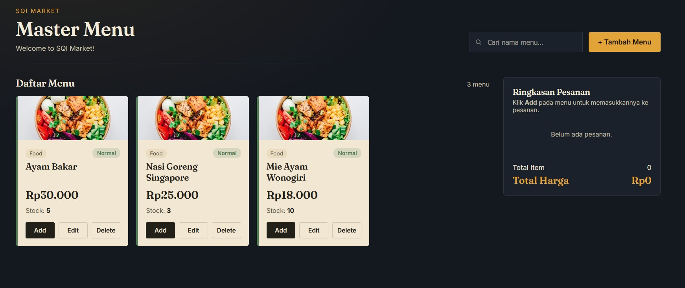

# SQI Market · Technical Assessment

## Studi Kasus: Menu Management

Membangun halaman **Master Menu** untuk aplikasi restoran menggunakan **HTML, CSS, dan Vanilla JavaScript**.

## Latar Belakang

Anda diminta membuat halaman **Master Menu** untuk sebuah aplikasi restoran. Halaman ini digunakan untuk mengelola daftar menu makanan dan minuman.

## Ketentuan Umum

- Gunakan **HTML, CSS, dan Vanilla JavaScript**.
- Data menu harus dirender secara dinamis menggunakan JavaScript.
- Tidak diperbolehkan menggunakan framework JavaScript.
- Desain antarmuka bebas selama seluruh fungsionalitas pada soal terpenuhi.
- File harus dalam bentuk **HTML, CSS, dan JavaScript** (JavaScript boleh digabung dengan file HTML).

## Data Awal

Gunakan API berikut untuk mengambil data-data produk:

```
https://vincent-guizot.github.io/mock-api/master-menu/menu.json
```

**Ketentuan:**

- `async` & `await` wajib digunakan saat memanggil API.
- `try...catch` wajib digunakan untuk menangani kegagalan request.
- Jika pengambilan data dari API gagal, gunakan data berikut sebagai fallback.

### Fallback Data — menus.js

```javascript
const menus = [
  {
    id: 1,
    name: "Nasi Goreng",
    category: "Food",
    price: 25000,
    stock: 3
  },
  {
    id: 2,
    name: "Mie Ayam",
    category: "Food",
    price: 18000,
    stock: 10
  },
  {
    id: 3,
    name: "Es Teh",
    category: "Drink",
    price: 5000,
    stock: 20
  },
  {
    id: 4,
    name: "Jus Alpukat",
    category: "Drink",
    price: 15000,
    stock: 2
  },
  {
    id: 5,
    name: "Ayam Bakar",
    category: "Food",
    price: 30000,
    stock: 5
  }
];
```

## Tugas

1. Ambil data menu dari API menggunakan async/await dan try...catch. Jika request gagal, gunakan data fallback yang telah disediakan.

2. Sebelum ditampilkan, lakukan transformasi data:
   - Tampilkan hanya menu dengan kategori `Food`.
   - Tambahkan properti `isLowStock` (`true` jika stock di bawah 3).
   - Urutkan data berdasarkan harga tertinggi ke terendah.

3. Tampilkan seluruh data menggunakan **CSS Grid** dengan ketentuan:
   - Desktop (>1024px): 4 kolom
   - Tablet (600–1024px): 2 kolom
   - Mobile (<600px): 1 kolom
   - Gap antar card 16px

4. Setiap card minimal menampilkan:
   - Nama Menu
   - Kategori
   - Harga
   - Stock
   - Status Stock
   - Tombol **Add**, **Edit**, dan **Delete**

5. Jika `isLowStock` bernilai `true`, tampilkan badge **Low Stock**; jika tidak, tampilkan **Normal**.

6. Buat form Tambah Menu yang terdiri dari:
   - Nama Menu
   - Kategori
   - Harga
   - Stock
   - Tombol **Simpan**

7. Terapkan validasi:
   - Nama Menu wajib diisi.
   - Kategori wajib diisi.
   - Harga wajib diisi dan lebih dari 0.
   - Stock wajib diisi, lebih dari 0, dan tidak boleh bernilai negatif.

8. Tambahkan fitur **Tambah ke Pesanan** dengan ketentuan:
   - Menu masuk ke daftar pesanan.
   - Jika menu sudah ada, quantity bertambah.
   - Jika stock habis, tombol Add dinonaktifkan.
   - Tampilkan ringkasan pesanan yang berisi daftar item, total item, dan total harga.
   - Buat fungsi `calculateTotal(order)` untuk menghitung total harga.

9. Tambahkan fitur pencarian berdasarkan nama menu menggunakan **debounce 500ms**.

10. Tombol **Delete** harus menghapus menu dari tampilan sekaligus dari array data.

## Catatan

Function pada tombol **Edit** bersifat opsional. Jika masih memiliki waktu, peserta dapat mengerjakannya.

## Referensi Tampilan

Gambar yang disediakan hanya digunakan sebagai referensi posisi. Peserta diberikan kebebasan untuk merancang tampilan sesuai kreativitas masing-masing selama memenuhi seluruh kebutuhan pada soal.

> *Gambar 1. Referensi posisi tampilan halaman Master Menu (lihat file asli untuk gambar).*

